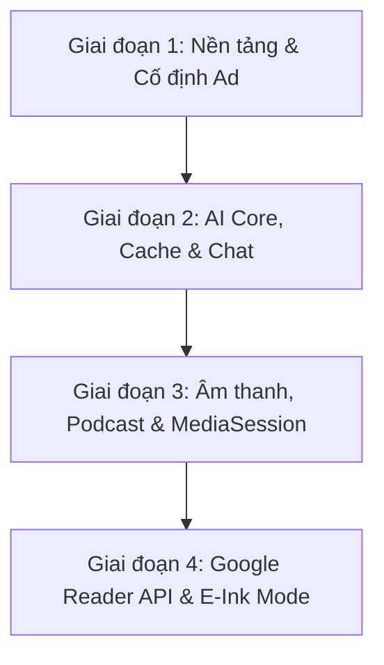

# 🚀 Sprint 01: Powerhouse (Gói 1 + 2 + 4) — Kế Hoạch Triển Khai Toàn Diện

> **Dự án:** RSS Cat Hub (`com.mckimquyen.reader`)  
> **Lựa chọn từ Product Owner:** **Kết hợp Gói 1 (AI & Đa ngữ) + Gói 2 (Âm thanh & Podcast) + Gói 4 (Hiệu năng & Nền tảng)**  
> **Trọng tâm:** Giữ nguyên `AdmobApplovinWrapper:1.1.5`, giải quyết triệt để nút thắt hiệu năng Room, xây dựng bộ trợ lý AI tương tác sâu và hệ thống âm thanh nghe báo/podcast đẳng cấp.  
> **Tổng Story Points:** `51 SP`  
> **Trạng thái:** `IN PROGRESS`

---

## 📊 Bảng Theo Dõi Tasks Sprint 01

| Trụ Cột | Mã Task | Tên Tính Năng | Phân Loại | SP | Trạng Thái | File Chính Cần Sửa |
|---|---|---|:---:|:---:|:---:|---|
| **Hiệu Năng & Nền Tảng** | **FIX-01** | Composite Indexes Room Database (`article`) | Performance | 3 | ⏳ Ready | [`domain/model/article/Article.kt`](file:///Users/loitran/AndroidStudioProjects/@mckimquyen/@playstore/@prodution/@ad/260620_ReadYou/app/src/main/java/com/mckimquyen/reader/domain/model/article/Article.kt), [`AndroidDb.kt`](file:///Users/loitran/AndroidStudioProjects/@mckimquyen/@playstore/@prodution/@ad/260620_ReadYou/app/src/main/java/com/mckimquyen/reader/infrastructure/db/AndroidDb.kt) |
| | **FIX-02** | Loại bỏ `LazyListState` khỏi ViewModel / UiState | Architecture | 3 | ⏳ Ready | [`ReadingViewModel.kt`](file:///Users/loitran/AndroidStudioProjects/@mckimquyen/@playstore/@prodution/@ad/260620_ReadYou/app/src/main/java/com/mckimquyen/reader/ui/page/home/read/ReadingViewModel.kt), [`FlowViewModel.kt`](file:///Users/loitran/AndroidStudioProjects/@mckimquyen/@playstore/@prodution/@ad/260620_ReadYou/app/src/main/java/com/mckimquyen/reader/ui/page/home/flow/FlowViewModel.kt) |
| | **FIX-03** | Bọc Error Isolation & Giảm Concurrency Sync | Reliability | 3 | ⏳ Ready | [`AbstractRssRepository.kt`](file:///Users/loitran/AndroidStudioProjects/@mckimquyen/@playstore/@prodution/@ad/260620_ReadYou/app/src/main/java/com/mckimquyen/reader/domain/sv/AbstractRssRepository.kt) |
| | **FIX-04** | Thay thế Favicon Heroku bằng Google/DuckDuckGo | Network | 2 | ⏳ Ready | [`RssHelper.kt`](file:///Users/loitran/AndroidStudioProjects/@mckimquyen/@playstore/@prodution/@ad/260620_ReadYou/app/src/main/java/com/mckimquyen/reader/infrastructure/rss/RssHelper.kt) |
| | **FIX-05** | Đẩy parse HTML sang Background Thread | Performance | 1 | ⏳ Ready | [`ReadingViewModel.kt`](file:///Users/loitran/AndroidStudioProjects/@mckimquyen/@playstore/@prodution/@ad/260620_ReadYou/app/src/main/java/com/mckimquyen/reader/ui/page/home/read/ReadingViewModel.kt) |
| | **FIX-08** | Bảo toàn & kiểm tra `AdmobApplovinWrapper:1.1.5` | Monetization | 1 | ⏳ Ready | [`app/build.gradle`](file:///Users/loitran/AndroidStudioProjects/@mckimquyen/@playstore/@prodution/@ad/260620_ReadYou/app/build.gradle), [`RApp.kt`](file:///Users/loitran/AndroidStudioProjects/@mckimquyen/@playstore/@prodution/@ad/260620_ReadYou/app/src/main/java/com/mckimquyen/reader/RApp.kt) |
| | **NEW-01** | Google Reader API (FreshRSS, Miniflux, Nextcloud) | Core Feature | 8 | ⏳ Ready | [`RssSv.kt`](file:///Users/loitran/AndroidStudioProjects/@mckimquyen/@playstore/@prodution/@ad/260620_ReadYou/app/src/main/java/com/mckimquyen/reader/domain/sv/RssSv.kt), [`googleReader/`](file:///Users/loitran/AndroidStudioProjects/@mckimquyen/@playstore/@prodution/@ad/260620_ReadYou/app/src/main/java/com/mckimquyen/reader/infrastructure/rss/provider/googleReader/) |
| | **IDEA-06**| Chế độ tối ưu màn hình E-Ink (E-Paper Mode) | Accessibility | 3 | ⏳ Ready | [`ColorAndStylePage.kt`](file:///Users/loitran/AndroidStudioProjects/@mckimquyen/@playstore/@prodution/@ad/260620_ReadYou/app/src/main/java/com/mckimquyen/reader/ui/page/setting/color/ColorAndStylePage.kt), [`Content.kt`](file:///Users/loitran/AndroidStudioProjects/@mckimquyen/@playstore/@prodution/@ad/260620_ReadYou/app/src/main/java/com/mckimquyen/reader/ui/page/home/read/Content.kt) |
| **AI & Đa Ngữ** | **ENH-03** | Lưu AI Summary vĩnh viễn & Cài đặt API Key | AI Feature | 5 | ⏳ Ready | [`GeminiSummaryService.kt`](file:///Users/loitran/AndroidStudioProjects/@mckimquyen/@playstore/@prodution/@ad/260620_ReadYou/app/src/main/java/com/mckimquyen/reader/infrastructure/ai/GeminiSummaryService.kt), [`SummarySheet.kt`](file:///Users/loitran/AndroidStudioProjects/@mckimquyen/@playstore/@prodution/@ad/260620_ReadYou/app/src/main/java/com/mckimquyen/reader/ui/page/home/read/SummarySheet.kt) |
| | **EXC-06** | "AI Deep Read" — Chat trực tiếp với bài báo | Exclusive AI | 5 | ⏳ Ready | [`ReadingPage.kt`](file:///Users/loitran/AndroidStudioProjects/@mckimquyen/@playstore/@prodution/@ad/260620_ReadYou/app/src/main/java/com/mckimquyen/reader/ui/page/home/read/ReadingPage.kt), [`GeminiSummaryService.kt`](file:///Users/loitran/AndroidStudioProjects/@mckimquyen/@playstore/@prodution/@ad/260620_ReadYou/app/src/main/java/com/mckimquyen/reader/infrastructure/ai/GeminiSummaryService.kt) |
| | **EXC-07** | Đọc song ngữ Anh-Việt & Dịch đoạn tức thì | Exclusive UX | 5 | ⏳ Ready | [`Reader.kt`](file:///Users/loitran/AndroidStudioProjects/@mckimquyen/@playstore/@prodution/@ad/260620_ReadYou/app/src/main/java/com/mckimquyen/reader/ui/component/reader/Reader.kt), [`Content.kt`](file:///Users/loitran/AndroidStudioProjects/@mckimquyen/@playstore/@prodution/@ad/260620_ReadYou/app/src/main/java/com/mckimquyen/reader/ui/page/home/read/Content.kt) |
| **Âm Thanh & Podcast** | **ENH-04** | TTS Foreground Service & MediaSession Lockscreen | Background Media | 5 | ⏳ Ready | [`TtsManager.kt`](file:///Users/loitran/AndroidStudioProjects/@mckimquyen/@playstore/@prodution/@ad/260620_ReadYou/app/src/main/java/com/mckimquyen/reader/infrastructure/audio/TtsManager.kt), Service mới |
| | **IDEA-05**| Trình phát Podcast & Audio RSS Player tích hợp | Media Player | 5 | ⏳ Ready | `infrastructure/audio/player/` |
| | **EXC-02** | "AI Podcast Studio" (Chuyển tin tức thành podcast 2 MC) | Exclusive Audio | 8 | ⏳ Ready | [`TtsManager.kt`](file:///Users/loitran/AndroidStudioProjects/@mckimquyen/@playstore/@prodution/@ad/260620_ReadYou/app/src/main/java/com/mckimquyen/reader/infrastructure/audio/TtsManager.kt), Prompt Engine |

---

## 🛠️ Lộ Trình 4 Đợt Triển Khai (Phasing)

### 1. Giai đoạn 1: Ổn định Database, Lifecycle & Ad Wrapper (FIX-01, FIX-02, FIX-03, FIX-04, FIX-05, FIX-08)
- Viết migration `MIGRATION_6_7` bổ sung composite index cho `article`.
- Chuyển `LazyListState` về `rememberLazyListState()` trong Compose.
- Bọc an toàn sync feed, giảm chunk concurrency xuống 6 kết nối.
- Thay thế endpoint Favicon sang Google/DuckDuckGo.
- Đảm bảo `AdmobApplovinWrapper` và cấu hình quảng cáo hoạt động chuẩn.

### 2. Giai đoạn 2: Trợ lý AI, Caching & Chat Trực Tiếp (ENH-03, EXC-06, EXC-07)
- Thêm cột `aiSummary` vào database, lưu tóm tắt vĩnh viễn.
- Thêm màn hình Settings nhập API Key (Gemini, OpenAI, Groq).
- Xây dựng BottomSheet "Hỏi đáp AI với bài báo" (AI Deep Read).
- Tạo cơ chế chạm để dịch inline đoạn văn sang tiếng Việt và chế độ đọc song ngữ.

### 3. Giai đoạn 3: Âm Thanh Đỉnh Cao & Podcast (ENH-04, IDEA-05, EXC-02)
- Xây dựng Android Foreground Service cho TTS (`mediaPlayback`), Media Notification màn hình khóa với Play/Pause/Skip 15s.
- Tích hợp Mini Player cho nguồn Podcast RSS (thẻ audio enclosure).
- Triển khai "AI Podcast Studio" sinh kịch bản đối thoại 2 MC và đọc luân phiên 2 tông giọng.

### 4. Giai đoạn 4: Mở Rộng Hệ Sinh Thái & E-Ink (NEW-01, IDEA-06)
- Hoàn thiện module `GoogleReaderRssRepository` và `GoogleReaderAPI` kết nối FreshRSS, Miniflux, Nextcloud News.
- Bổ sung Theme đơn sắc tương phản cao (Pure B&W) và cử chỉ chạm lật trang tối ưu cho máy đọc sách E-Ink.
